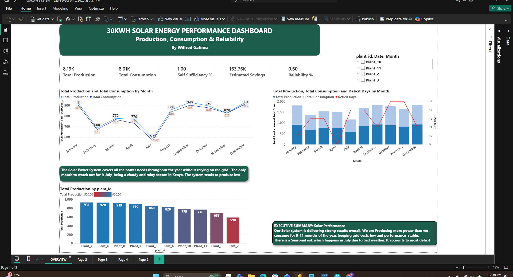
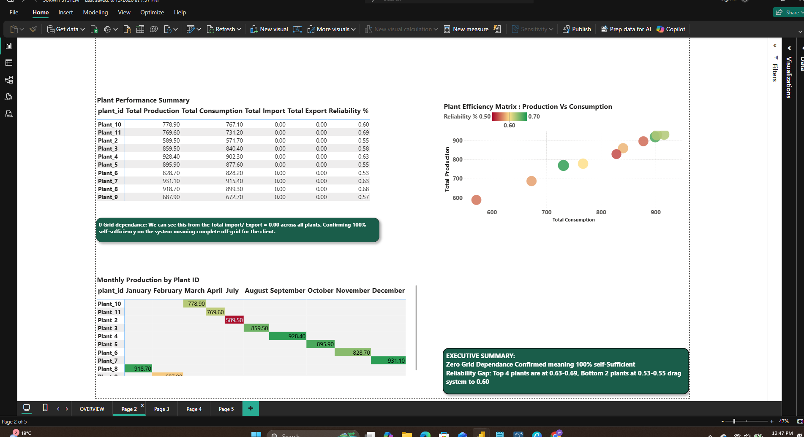
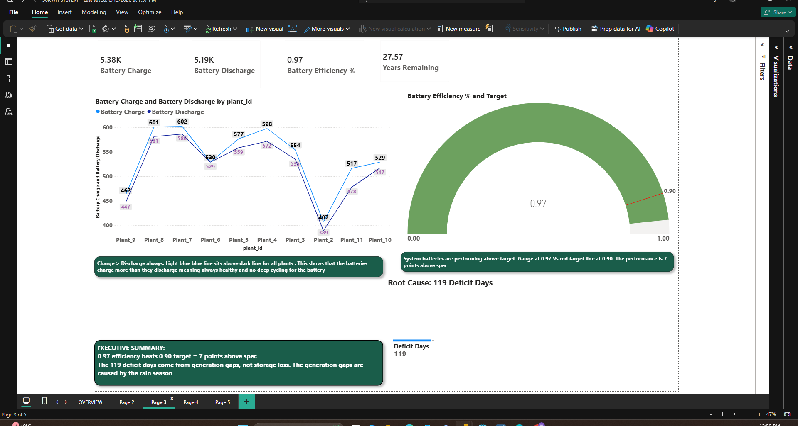
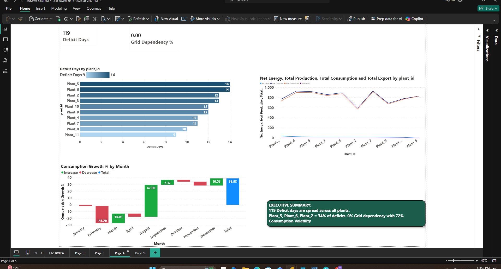
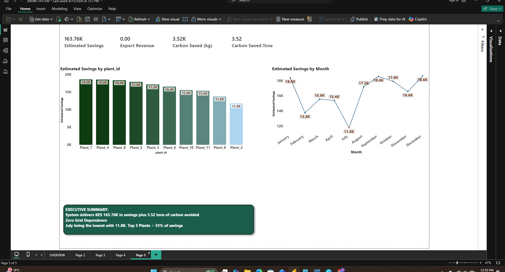

# 30Kwh-Off-Grid-Solar-System
Power Bi dashboard analyzing a 30Kwh off-grid solar + battery system. Tracks production, reliability, battery health, savings, carbon impact for 9 plants in Karen, Nairobi
### Power Bi | DAX | Data Visualization | Energy Analytics

**Project Overview**
- ** 100% off-grid**: 0% Grid dependency across all 9 plants
- **Reliability**: Avg 0.60, range 0.53 - 0.69. 2 plants identified as underperformers
- **Battery Health**: 87% Efficiency Vs the 80% target
- **Impact**: KES 163.76k saved, 3.52 tons C02 avoided in 12 months
- **Risk**: 119 Deficit Days total, 34% from Plant_5, Plant_6, Plant_2

### Data Engineering
-Daily plant tables were combined using SQL. You find this in [sql/data_cleaning.sql](sql/data_cleaning.sql):
-**'CREATED TABLE solar_daily_system'** created and Defined a clean schema for  solar data:
-**'UNION ALL'** Combined the 9 plants into one table for analysis
-**Portfolio KPIs**: Production totals, consumption, grid feed-in, and battery efficiency queries are included

**Dataset Structure**
## Dataset Schema 
*Note: Real data is confidential. This shows structure only.*

| Column | Type | Description |
| --- | --- | --- |
| plant_id | text | Plant identifier, e.g. Plant_10 |
| date | date | Daily record date |
| daily_production_kwh | float | kWh generated per day |
| daily_consumption_kwh | float | kWh consumed per day |
| daily_grid_feed_in_kwh | float | kWh fed to grid |
| daily_purchased_kwh | float | kWh bought from grid |
| daily_charge_kwh | float | kWh used to charge battery |
| daily_discharge_kwh | float | kWh discharged from battery |
 
**Dashboard Pages**
**1. Plant summary**

**2. Efficiency Matrix**

**3. Monthly Production Trends**

**4. Battery Deficit**

**5. savings & carbon impact**

**Tools**: 
SQL, Power BI, DAX, Data Modeling
